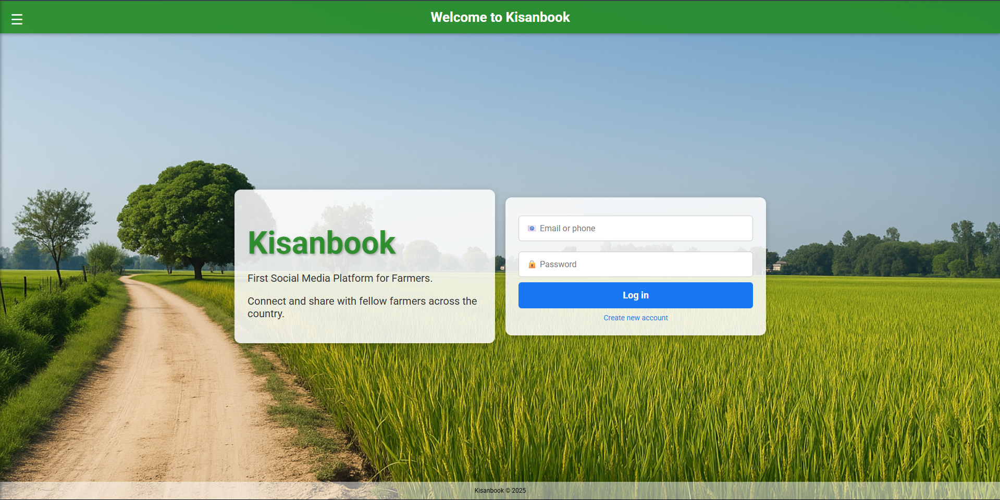
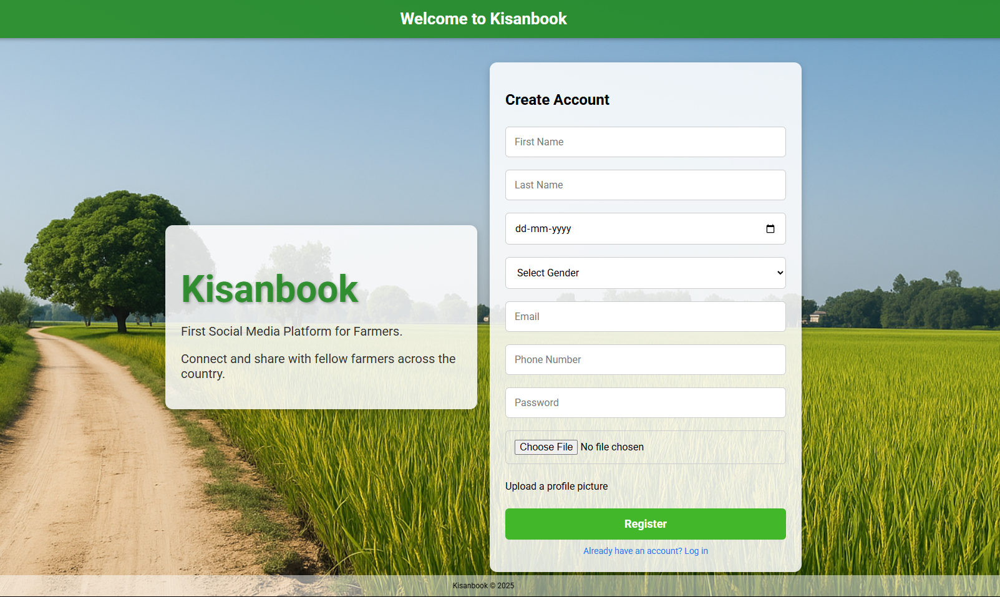
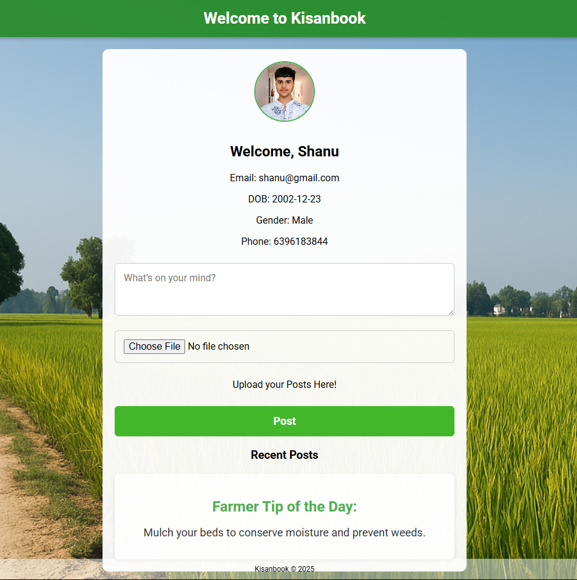

# 🌾 Kisanbook

**Kisanbook** is a social media web platform built specifically for farmers. It allows farmers to connect, share updates, get help, and build a digital farming community. This project is designed with simplicity, usability, and connectivity in mind.

---

## 🚀 Features

- 👤 User Registration and Login
- 📰 Post creation and sharing (like Facebook)
- 💬 Farmer-to-farmer interaction
- 📸 Screenshots of UI included
- 🌿 Clean and responsive design

---

## 📸 Screenshots

### 🔹 Main Page


### 🔹 Register Page


### 🔹 Dashboard


---

## 💻 Tech Stack

- **HTML/CSS** – Structure and Styling
- **JavaScript** – Form logic and local storage handling
- **LocalStorage** – Temporary data handling (in development phase)
- *(Future upgrades: Firebase, GPS integration, chat module, etc.)*

---

## 🛠️ How to Run

1. Clone the repository:
   ```bash
   git clone https://github.com/ishanuchaudhary/kisanbook.git

---

## 📂 Folder Structure

kisanbook/
│
├── index.html
├── style.css
├── script.js
├── screenshots/
│   ├── main.png
│   ├── register.png
│   └── dashboard.png
└── README.md

---

## 📌 Future Plans

- 🌐 Firebase or AWS integration for user data
- 🧭 GPS tagging for posts (attendance/location verification)
- 📲 Mobile-first responsive design
- 💬 Real-time chat or Q&A section
- 🗂️ Admin dashboard for moderation

---

## 🤝 Contribution

Pull requests are welcome! If you’d like to suggest new features or improvements, feel free to open an issue.

---

## 📃 License

This project is open-source and free to use under the [MIT License](LICENSE).

---

## ✨ Created with ❤️ by Sanskar Singh

[](https://www.linkedin.com/in/sanskar9929/)
[](https://github.com/ishanuchaudhary)


